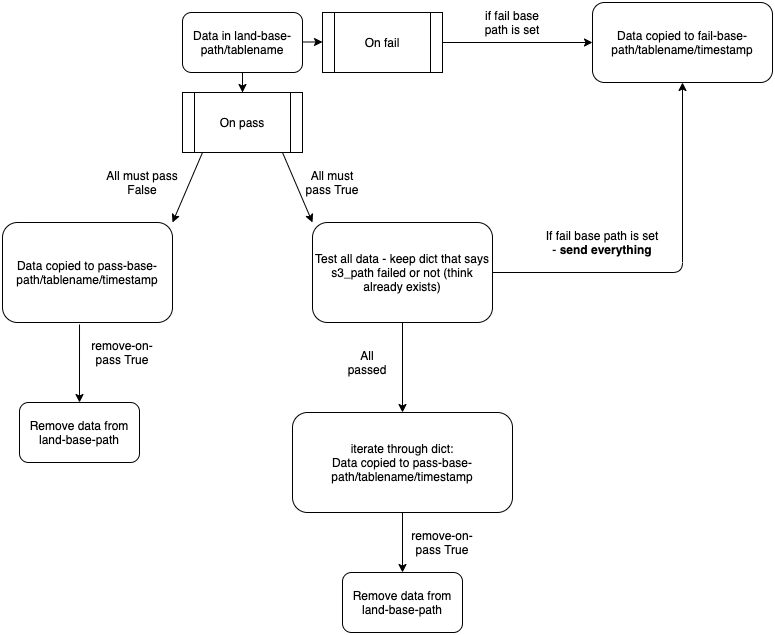

# Data Linter

A python package to to allow automatic validation of data as part of a Data Engineering pipeline. It is designed to read in and validate tabular data against a given schema for the data. The schemas provided adhere to [our metadata schemas standards](https://github.com/moj-analytical-services/mojap-metadata/) for data. This package can also be used to manage movement of data from a landing area (s3 or locally) to a new location based on the result of the validation.

This package implements different validators using different packages based on the users preference:
- `pandas`: (default) Uses our own lightweight pandas dataframe operations to run simple validation tests on the columns based on the datatype and additional tags in the metadata. Utilises pyarrow for reading data.
- `frictionless`: Uses Frictionless data to validate the data against our metadata schemas. More information can be found [here](https://github.com/frictionlessdata/frictionless-py/)
- `great-expectations`: Uses the Great Expectations data to validate the data against our metadata schemas. More information can be found [here](https://github.com/great-expectations/great_expectations)


## Installation

```bash
pip install data_linter # pandas validator only
```

Or to install the necessary dependencies for the non-default validators.

```bash
pip install data_linter[frictionless] # To include packages required for the frictionless validator

# OR

pip install data_linter[ge] # To include packages required for teh great-expectations validator
```


## Usage

This package takes a `yaml` based config file written by the user (see example below), and validates data in the specified s3 folder path against specified metadata. If the data conforms to the metadata, it is moved to the specified s3 folder path for the next step in the pipeline (note can also provide local paths for running locally). Any failed checks are passed to a separate location for testing. The package also generates logs to allow you to explore issues in more detail.

### Simple Use

To run the validation, at most simple you can use the following:

**In Python:**

```python
from data_linter import run_validation

config_path = "config.yaml"

run_validation(config_path)
```

**Via command line:**

```bash
data_linter --config_path config.yaml
```

### Example config file

```yaml
land-base-path: s3://testing-bucket/land/  # Where to get the data from
fail-base-path: s3://testing-bucket/fail/  # Where to write the data if failed
pass-base-path: s3://testing-bucket/pass/  # Where to write the data if passed
log-base-path: s3://testing-bucket/logs/  # Where to write logs
compress-data: true  # Compress data when moving elsewhere (only applicable from CSV/JSON)
remove-tables-on-pass: true  # Delete the tables in land if validation passes
all-must-pass: true  # Only move data if all tables have passed
fail-unknown-files:
    exceptions:
        - additional_file.txt
        - another_additional_file.txt

validator-engine: pandas # will default to this if unspecified
# (but other options are `frictionless` and `great-expectations`)

# Tables to validate
tables:
    table1:
        required: true  # Does the table have to exist
        pattern: null  # Assumes file is called table1 (same as key)
        metadata: meta_data/table1.json # local path to metadata

    table2:
        required: true
        pattern: ^table2
        metadata: meta_data/table2.json
        row-limit: 10000 # for big tables - only take the first x rows
```

You can also run the validator as part of a python script, where you might want to dynamically generate your config:

```python
from data_linter.validation import run_validation

base_config = {
    "land-base-path": "s3://my-bucket/land/",
    "fail-base-path": "s3://my-bucket/fail/",
    "pass-base-path": "s3://my-bucket/pass/",
    "log-base-path": "s3://my-bucket/log/",
    "compress-data": False,
    "remove-tables-on-pass": False,
    "all-must-pass": False,
    "validator-engine": "great-expectations",
    "validator-engine-params": {"default_result_fmt": "BASIC", "ignore_missing_cols": True},
    "tables": {}
}

def get_table_config(table_name):
    d = {
        "required": False,
        "expect-header": True,
        "metadata": f"metadata/{table_name}.json",
        "pattern": r"^{}\.jsonl$".format(table_name),
        "headers-ignore-case": True,
        "only-test-cols-in-metadata": True # Only currently supported by great-expectations validator
    }
    return d

for table in ["table1", "table2"]:
    base_config["tables"][table_name] = get_table_config(table_name)

run_validation(base_config) # Then watch that log go...
```

### Validating a single file

> Without all the bells and whistles

If you do not need `data_linter` to match files to a specified config, log the process and then move data around based on the outcome of the validation you can just use the validators themselves:

```python
# Example using simple pandas validatior (without added data_linter features)
import json
from data_linter.validators import PandasValidator

filepath = "tests/data/end_to_end1/land/table1.csv"
table_params = {
    "expect-header": True
}
with open("tests/data/end_to_end1/meta_data/table1.json") as f:
    metadata = json.load(f)

pv = PandasValidator(filepath, table_params, metadata)
pv.read_data_and_validate()

pv.valid  # True (data in table1.csv is valid against metadata)
pv.response.get_result()  # Returns dict of all tests ran against data

# The response object of for the PandasValidator in itself, and has it's own functions
pv.get_names_of_column_failures()  # [], i.e. no cols failed
```


### Parallel Running

Data Linter can also work in parallel to trigger multiple validations at once (only supports use of S3 atm). An example below:

In this scenario we use the parallisation process to init the process split the job into 4 validators and then run the closedown.

- **The init stage** splits the config into 4 chunks, based on the file size of the data sitting in the specified land path. It split configs are written to a temporary path in S3 for each validator to pick up and run in parallel.
- **The validator stage** can be ran in parallel (for simplicity they are run sequentially in the example below). Each validator will take the config in the temp folder path and process the files given in that subsetting config.
- **The closedown stage** will take all the logs all validator runs, conbine them then move the data based on the validators results. It will then finally clean up the temp folder.

```python
# Simple example running DL with multiple validators (in this case 4)
# [init] -> [validator]x4 -> [closedown]
import yaml
from data_linter import validation
from dataengineeringutils3.s3 import get_filepaths_from_s3_folder


simple_yaml_config = """
land-base-path: s3://land/
fail-base-path: s3://fail/
pass-base-path: s3://pass/
log-base-path: s3://log/

compress-data: false
remove-tables-on-pass: true
all-must-pass: true

# Tables to validate
tables:
  table1:
    required: true
    metadata: tests/data/end_to_end1/meta_data/table1.json
    expect-header: true

  table2:
    required: true
    pattern: ^table2
    metadata: tests/data/end_to_end1/meta_data/table2.json
"""

test_folder = "tests/data/end_to_end1/land/"
config = yaml.safe_load(simple_yaml_config)

# Init stage
validation.para_run_init(4, config)

# Validation stage (although ran sequencially this can be ran in parallel)
for i in range(4):
    validation.para_run_validation(i, config)

# Closedown stage
validation.para_collect_all_status(config)
validation.para_collect_all_logs(config)
```

> There are more parallelisation examples, which can be found in the [test_simple_examples.py test module](tests/test_simple_examples.py)

## Validators

### Pandas

THis is the default validator used by data_linter as of the version 5 release.

#### Dealing with timestamps and dates

Timestamps are always a pain to deal with especially when using different file types. The Pandas Validator has tried to keep true to the file types based on the tests it runs.

If the file type stores date/timestamp information as a string (i.e. CSV and JSONL) then the pandas Validator will read in the timestamp / date columns as strings. It will then apply validation tests against those columns checking if the string representation of the dates in the data is a valid date. For timestamp and date types these tests assume ISO standard string representation `%Y-%m-%d %H:%M:%S` and `%Y-%m-%d`. If your timestamp/date types are comming in as strings that do not conform to the ISO standard format then you can provide you column in the metadata with a `datetime_format` property that specifies the exected format e.g.

```json
...
"columns": [
    {
        "name": "date_in_uk",
        "type": "date64",
        "datetime_format": "%d/%m/%Y"
    },
...
```

Often you might recieve data that is exported from a system that might encode your timestamp as a date but is written to a format that encodes the data as a timestamp. In this scenario you would expect your dates (in a str timestamp format) to always have a time component of `00:00:00`. You can also use data_linter to validate this by specifing the datetime_format of your column as the expected timestamp in format but still specify that the data type is a date e.g.

```json
...
"columns": [
    {
        "name": "date_in_uk",
        "type": "date64",
        "datetime_format": "%d/%m/%Y 00:00:00"
    },
...
```

In the above data_linter will attempt to fist parse the column with the specified `datetime_format` and then as the column type is date it will check that it it truely a date (and not have a time component).

If the file_format is `parquet` then timestamps are encoded in the filetype and there are just read in as is. Currently data_linter doesn't support minimum and maximum tests for timestamps/dates and also does not currently have tests for time types. 


### Frictionless

Known errors / gotchas:
- Frictionless will drop cols in a jsonl files if keys are not present in the first row (would recommend using the `great-expectations` validator for jsonl as it uses pandas to read in the data). [Link to raised issue](https://github.com/frictionlessdata/frictionless-py/issues/490).


### Great Expectations

Known errors / gotchas:
- When setting the "default_result_fmt" to "COMPLETE" current default behavour of codebase. You may get errors due to the fact that the returned result from great expectations tries to serialise a `pd.NA` (as a value sample in you row that failed an expectation) when writing the result as a json blob. This can be avoided by setting the "default_result_fmt" to "BASIC" as seen in the Python example above. [Link to raised issue](https://github.com/great-expectations/great_expectations/issues/2029).


#### Additional Parameters

- `default_result_fmt`: This is passed to the GE validator, if unset default option is to set the value to `"COMPLETE"`. This value sets out how much information to be returned in the result from each "expectation". For more information [see here](https://docs.greatexpectations.io/en/v0.4.0/result_format.html). Also note the safest option is to set it to `"BASIC"` for reasons discussed in the gotcha section above.

- `ignore_missing_cols`: Will not fail if columns don't exist in data but do in metadata (it ignores this).


## Process Diagram

How logic works



## How to update

We have tests that run on the current state of the `poetry.lock` file (i.e. the current dependencies). We also run tests based on the most up to date dependencies allowed in `pyproject.toml`. This allows us to see if there will be any issues when updating dependences. These can be run locally in the `tests` folder.

When updating this package, make sure to change the version number in `pyproject.toml` and describe the change in CHANGELOG.md.

If you have changed any dependencies in `pyproject.toml`, run `poetry update` to update `poetry.lock`.

Once you have created a release in GitHub, to publish the latest version to PyPI, run:

```bash
poetry build
poetry publish -u <username>
```

Here, you should substitute <username> for your PyPI username. In order to publish to PyPI, you must be an owner of the project.